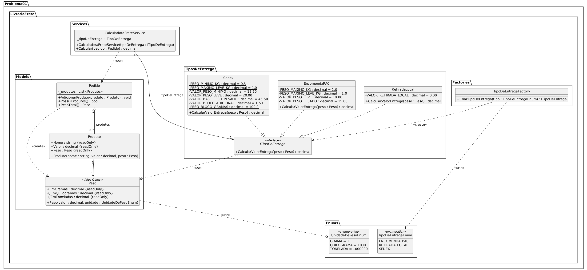

# Problema 01 - Sistema de Cálculo de Frete para Livraria

Sistema para calcular o valor de entrega de pedidos de uma livraria, com três modalidades: PAC, Sedex e Retirada no Local.

## Executar

```bash
dotnet run --project Problema01.csproj
```

## Testes

```bash
dotnet test Problema01.csproj
```

## Como Usar

1. O sistema vai solicitar o nome, valor e o peso de cada produto para cadastro.
2. Para finalizar o cadastro de produtos, digite **fim** quando o nome do produto for solicitado.
3. Ao final do cadastro, o sistema vai pedir qual o tipo de envio desejado (PAC, Sedex ou Retirada no Local).

## Diagrama de Classes


