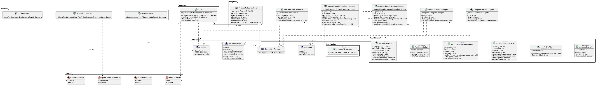

# Problema 03 - CasaSmart

Sistema de automação residencial inteligente com controle de dispositivos (lâmpadas, ar-condicionado e persianas) utilizando os padrões Adapter, Observer e Factory.

## Executar

```bash
dotnet run --project Problema3/CasaSmart/CasaSmart.csproj
```

## Testes

```bash
dotnet test Problema3/CasaSmart/CasaSmart.csproj
```

## Diagrama de Classes


